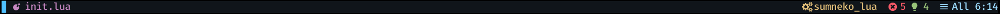

# Lunarline
> A neovim statusline written in lua


Out of the box


## ⭐Features
1. Fast, beautiful, Customizable
2. Components:
    * git branch
    * git diff
    * lsp diagnostics
    * active clients
    * file percentage
    * line column


## Requirements
* Neovim >= 0.5
* [kyazdani42/nvim-web-devicons](https://github.com/kyazdani42/nvim-web-devicons) (requires [patched font](https://www.nerdfonts.com/))

# Installation
* packer
```lua
use 'Murtaza-Udaipurwala/lunarline.nvim'
use 'kyazdani42/nvim-web-devicons'
```

* vim-plug
```vim
Plug 'Murtaza-Udaipurwala/lunarline.nvim'
Plug 'kyazdani42/nvim-web-devicons'
```

# Get started
This will load up lunarline with its default configuration
```lua
require('lunarline').setup()
```


## Customisation
```lua
local palette = {
    red = "#f65866",
    light_blue = "#9CDCFE",
    vivid_blue = "#4FC1FF",
    green = "#98c379",
    orange = "#ff8800",
    purple = "#C586C0",
    yellow = "#e1be79",
    black = "#10151a",
    white = "#f9f5d7",
}

require('lunarline').setup({
    -- enable/disable components
    options = {
        filename = true,
        git_branch = true,
        active_clients = false,
        diagnostics = true,
        cursor_position = true,
        line_col = true,
    },

    -- theme = 'original', -- currently lunarline only has the original theme

    -- defining a custom theme
    colors = {
        active = {bg = palette.black, fg = palette.white},
        inactive = {bg = "NONE", fg = palette.white},
        mode_bar = {
            bg = palette.black,
            fg = {
                normal = palette.vivid_blue,
                insert = palette.red,
                visual = palette.yellow,
                command = palette.green,
                other = palette.black,
            }
        },
        filename = {fg = palette.purple, bg = palette.black},
        git_branch = {fg = palette.green, bg = palette.black, style = "bold"},
        active_clients = {fg = palette.yellow, bg = palette.black},
        lsp_diagnostics = {
            bg = palette.black,
            fg = {
                error = palette.red,
                warning = palette.orange,
                info = palette.vivid_blue,
                hint = palette.green,
            }
        },
        cursor_position = {fg = palette.light_blue, bg = palette.black},
        line_col = {fg = palette.light_blue, bg = palette.black},
    }
})
```


# TODO
- [x] Git diff
- [ ] python virtualenv


# Issues
If your statusline isn't correctly highlighted, make sure lunarline is setup() after your colorscheme.
